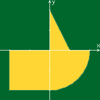

Лабораторная работа #2

Variant: 3110

Develop a web application based on servlets and JSP that determines whether a point on a coordinate plane falls within a given area.

The application must be implemented according to the MVC pattern and consist of the following elements:

A ControllerServlet that defines the type of request and, depending on whether the request contains point coordinates and radius information, delegates its processing to one of the following components. All requests within the application must be transmitted to this servlet (using the GET or POST method, depending on the job option); other servlets from web pages should not be called directly.

AreaCheckServlet, which checks whether a point falls into an area on the coordinate plane and generates an HTML page with the results of the check. Must process all requests containing information about the coordinates of a point and the radius of an area.

A JSP page that generates an HTML page with a web form. Must process all requests that do not contain information about the coordinates of the point and the radius of the area.

The developed JSP page should contain:

A “header” containing the student’s name, group number and variant number.

A form that sends data to the server.

A set of fields for specifying the coordinates of a point and the radius of an area in accordance with the specification option.

A JavaScript script that validates values ​​entered by the user into form fields.

An interactive element containing an image of an area on the coordinate plane (in accordance with the task option) and implementing the following functionality:

If the radius of the area is set, a mouse click on the image should be processed by a JavaScript function that determines the coordinates of the point clicked by the user and sends the resulting coordinates to the server to check whether it was hit.

В противном случае, после клика по картинке должно выводиться сообщение о невозможности определения координат точки.

After checking that a point has entered the area, the image must be updated taking into account the results of this check (i.e., a new point must appear on it).

A table with the results of previous checks. The list of results should be taken from the application context, HTTP-session or Bean, depending on the option. (Mine is HTTP session)

The page returned by AreaCheckServlet should contain:

A table containing the obtained parameters.

The result of the calculations is the, i.e. whether the point falls or does not fall into the area.

A link to a page with a web form for creating a new request.

The developed web application must be deployed on the WildFly server. The server must be launched in a standalone configuration, the ports must be configured in accordance with the issued portbase, access to the http listener must be open to all IPs.

Questions for defending laboratory work:

Java servlets. Implementation features, key methods, advantages and disadvantages regarding CGI and FastCGI.

Servlet containers. Servlet life cycle.

Dispatching requests in servlets. Servlet filters.

HTTP sessions - purpose, interaction of servlets with the session, methods of transmitting the session identifier.

ServletContext - purpose, ways of interaction of servlets with the context.

JavaServer Pages. Features, advantages and disadvantages compared to servlets, scope.

JSP life cycle.

JSP page structure. Comments, directives, declarations, scriptlets and expressions.

Rules for writing Java code inside JSP. Standard variables available in scriptlets and expressions.

Bean-components and their usage in JSP.

Standard JSP tags. Using Expression Language (EL) in JSP.

JSP configuration options in the web application deployment descriptor.

Design patterns and architectural patterns. Use in web applications.

Web application architecture. MVC pattern. Architectural models Model 1 and Model 2 and their implementation on the Java EE platform.
